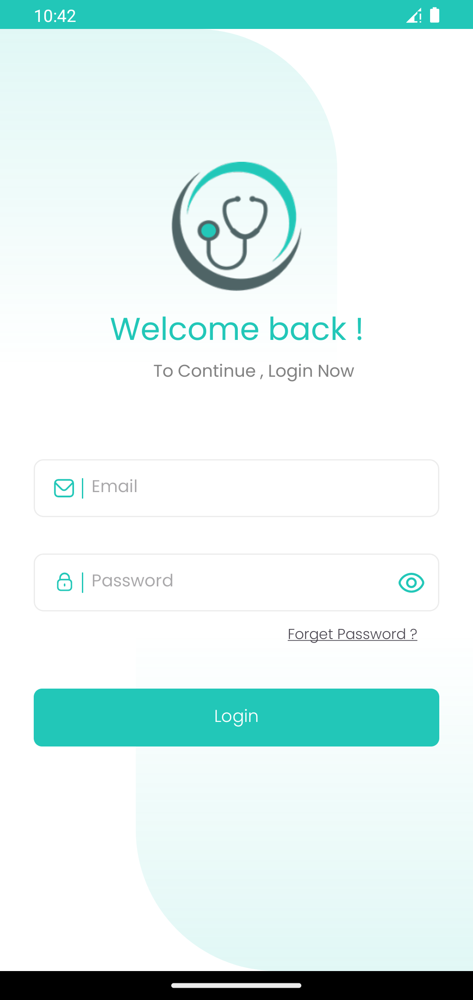
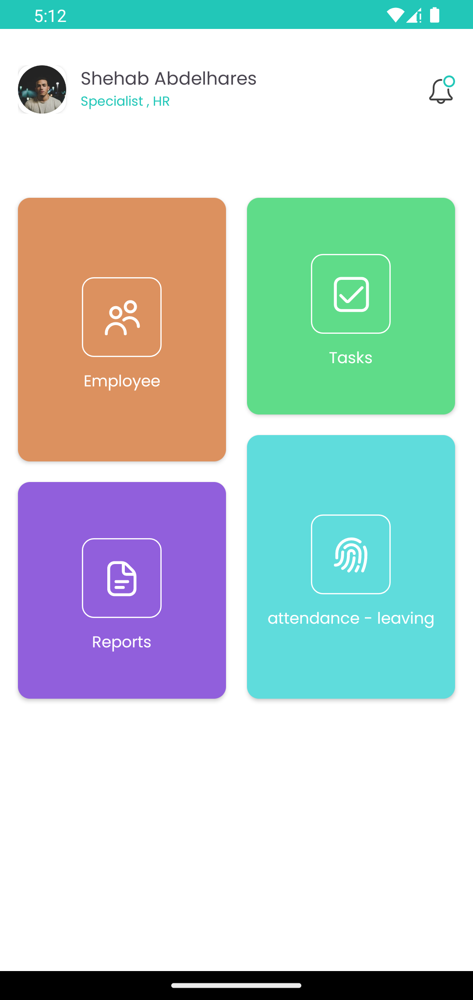
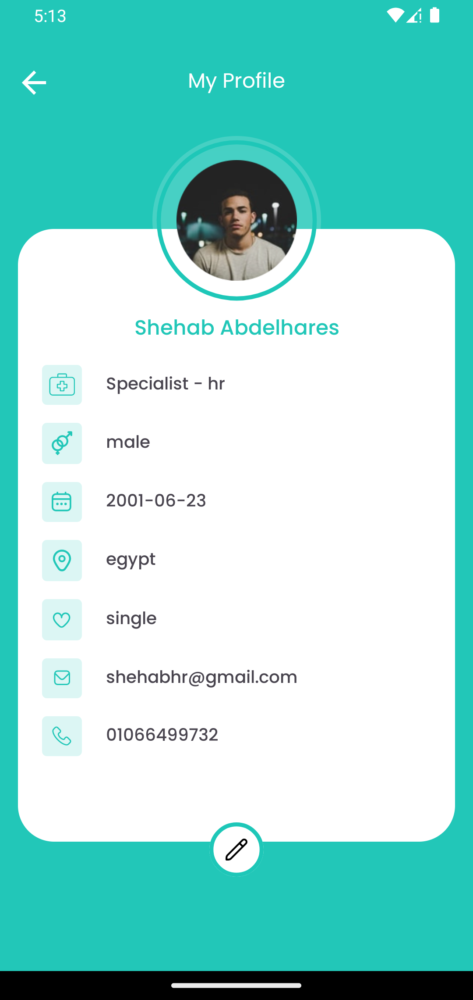

# HospitalApp

A scalable Android hospital management application built with **Clean Architecture** and **MVVM** to support multiple hospital roles and streamline internal hospital operations.

## 📸 Screenshots

<p align="center">
  
  
  
  
  
</p>

---

# 🏥 Overview

HospitalApp is a role-based hospital management system designed to improve communication and workflow between hospital staff members.

The application supports multiple user roles where each role has its own permissions and responsibilities inside the system.

---

# 👥 Supported Roles

- 👨‍⚕️ Doctor
- 👩‍⚕️ Nurse
- 🧾 Receptionist
- 📊 Analyst
- 👨‍💼 HR
- 🏢 Manager

Each role has a customized home screen and specific functionalities based on hospital workflow requirements.

---

# ✨ Features

## 🔐 Authentication
- Role-based access control for hospital staff
- Secure login system using custom backend APIs
- Employee registration handled by HR through dedicated APIs
- Persistent login using SharedPreferences
- Automatic navigation based on user role

---

## 👨‍💼 HR Features
- View all hospital employees
- Add new employees
- Manage employee information

---

## 👨‍⚕️ Doctor Features
- View assigned patients
- Request medical tests for patients
- Communicate with nurses through task requests

---

## 👩‍⚕️ Nurse Features
- Receive doctor requests
- Handle patient-related tasks
- Update task status

---

## 📊 Analyst Features
- Access hospital-related analytics and reports

---

## 🏢 Manager Features
- Monitor hospital operations
- Access management-related data

---

# 🧱 Architecture

The project follows **Clean Architecture** combined with the **MVVM** pattern for better scalability, maintainability, and separation of concerns.

---

## 📦 Layers Overview

### 🔹 Data Layer
Responsible for handling data sources and implementation details.

- Retrofit API Services
- Remote Data Sources
- Repository Implementations
- DTOs & Mappers

---

### 🔹 Domain Layer
Contains the core business logic.

- Use Cases
- Repository Interfaces
- Domain Models

---

### 🔹 Presentation Layer
Responsible for UI and state management.

- XML UI
- Fragments
- ViewModels
- LiveData Observers

---

# 🛠️ Tech Stack

| Layer        | Technology                |
|--------------|---------------------------|
| Language     | Kotlin                    |
| UI           | XML                       |
| Architecture | Clean Architecture + MVVM |
| Dependency Injection | Hilt                      |
| Networking   | Retrofit                  |
| Authentication | Custom Backend APIs       |
| Async        | Kotlin Coroutines         |
| State Management | LiveData                  |
| Local Storage | SharedPreferences         |
| Navigation   | Navigation Component      |

---

# 🔄 Workflow Example

1. HR registers new employee through dedicated APIs
2. Employees log in using their assigned credentials.
3. The app determines the user's role.
4. The user is redirected to a role-specific home screen.
5. Hospital staff interact with different modules based on permissions.

---

# 🚀 Setup

1. Clone the repository

```bash
git clone https://github.com/SHEHAB7x/HospitalApp.git
```

2. Open the project in Android Studio

3. Connect Firebase to the project

4. Add your `google-services.json` file

5. Build and run the application

---

# 📱 Future Improvements

- Push Notifications
- Real-time Chat System
- Dark Mode
- Patient Appointment Scheduling
- Offline Caching
- Unit Testing

---

# 👨‍💻 Author

Built by **Shehab Abdelhares**
[GitHub](https://github.com/SHEHAB7x) · [LinkedIn](https://www.linkedin.com/in/shehab0x/)